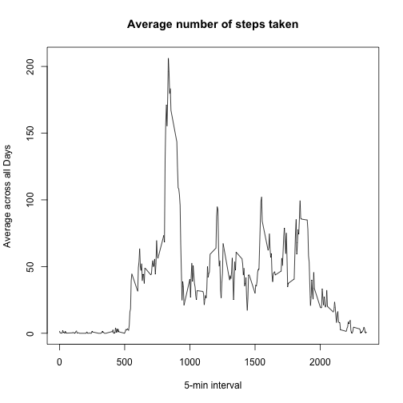

Reproducible research. Project 1
=================================
## Loading data and packages
Through this code the data was loaded from the file activity.csv. The date variable was converted into "Date" format.

```r
library(dplyr)
data<-read.csv("activity.csv",header = T,sep = ",",na.strings="NA")
```

```
## Warning in file(file, "rt"): не могу открыть файл 'activity.csv': No such
## file or directory
```

```
## Error in file(file, "rt"): не могу открыть соединение
```

```r
data$date<-as.Date(data$date)
```

## What is mean total number of steps taken per day?
Now calculate the total number of steps taken per day. 

```r
datagr<-group_by(data,date)
totalsteps<-summarise(datagr,sum=sum(steps))
```

The histogram of the total number of steps taken each day is presented below.

```r
hist(totalsteps$sum, col="blue", main="Total number of steps taken each day", xlab="total steps", breaks=8)
```

 


```r
meanst<-mean(totalsteps$sum,na.rm = T)
medianst<-median(totalsteps$sum,na.rm = T)
```

The mean of the total number of steps taken per day is 

```r
meanst
```

```
## [1] 10766.19
```

and the median is 

```r
medianst
```

```
## [1] 10765
```


## What is the average daily activity pattern?


```r
averstepsdata<-group_by(data,interval)
aversteps<-summarise(.data = averstepsdata,average=mean(steps,na.rm = T))
plot(aversteps$interval,aversteps$average, type = "l",xlab = "5-min interval", 
    ylab = "Average across all Days", main = "Average number of steps taken")
```

 

```r
maxintervalindex<-which.max(aversteps$average)
maxinterval<-aversteps$interval[maxintervalindex]
```
On average across all the days in the dataset, interval "835" contains the maximum number of steps.

## Imputing missing values

Let's calculate the total number of missing values.

```r
nas<-is.na(data)
sumna<-sum(nas)
```
There are 2304 missing values.

Now substitute NAs with mean value of the day.

```r
newdata<-data
for (i in 1:length(data$steps)) {
      if (nas[i,1]) {
      newdata$steps[i]<-aversteps$average[i]
      }
}
```

Do the same procedure with newdata as we did at the beginning with data.

Now calculate the total number of steps taken per day. 

```r
newdatagr<-group_by(newdata,date)
newtotalsteps<-summarise(newdatagr,sum=sum(steps))
```

The histogram of the total number of steps taken each day is presented below.

```r
hist(newtotalsteps$sum, col="blue", main="Total number of steps taken each day", xlab="total steps", breaks=8)
```

 


```r
newmeanst<-mean(newtotalsteps$sum,na.rm = T)
newmedianst<-median(newtotalsteps$sum,na.rm = T)
```

The mean of the total number of steps taken per day is 

```r
newmeanst
```

```
## [1] 10766.19
```

and the median is 

```r
newmedianst
```

```
## [1] 10765.59
```

As we substituted NAs with mean values, mean is the same. But median changed a little.

## Are there differences in activity patterns between weekdays and weekends?

Creating the new factor variable for weekdays/weekends.

```r
newdata$weekday<-as.factor(weekdays(newdata$date))
levels(newdata$weekday)[c(1,6)]<-"weekend"
levels(newdata$weekday)[-1]<-"weekday"
stepsByDay <- aggregate(steps ~ interval + weekday, data = newdata, mean)
names(stepsByDay) <- c("interval", "weekday", "steps")
```
 Making the plot.
 

```r
library(lattice)
xyplot(steps~interval|weekday,data = stepsByDay, type="l", layout=c(1,2), xlab="5-mintute intervals", ylba="Number of steps")
```

 
